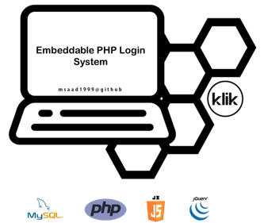

<p align="center">
  
</p><br>

> **`Project Abandoned`**. This project has been abandoned and might be out of date with current standards and with respect to security and features etc.. I may revamp this project in the future but there is no further development planned at the moment.

> Embeddable and Highly Secure PHP Authentication System with Login, Signup, User Profiles, Profile Editing, Account Verification via Email, Password Reset System, Remember Me Feature, Automatic Logout on Inactivity,  Global ERROR & STATUS variable system, Authentication checks and more.

# Table of Contents

- [Table of Contents](#table-of-contents)
  - [Getting Started](#getting-started)
    - [Requirements](#requirements)
    - [Installation](#installation)
    - [Existing Account(s)](#existing-accounts)
    - [Project File Structure](#project-file-structure)
    - [Building on top of System](#building-on-top-of-system)
  - [Components](#components)
    - [Languages](#languages)
    - [Development Environment](#development-environment)
    - [External Resources/Plugins](#external-resourcesplugins)
  - [Features](#features)
    - [Easy Integration / Embedding](#easy-integration--embedding)
    - [Security](#security)
      - [SQL Injection Protection](#sql-injection-protection)
      - [Header & Email Injection Protection](#header--email-injection-protection)
      - [CSRF Protection](#csrf-protection)
      - [Secure Remember-me Cookie](#secure-remember-me-cookie)
      - [Secure Account Activation & Password Reset](#secure-account-activation--password-reset)
    - [Login | Signup](#login--signup)
    - [Automatic Logout on Inactivity](#automatic-logout-on-inactivity)
    - [User Profile | Profile Editing](#user-profile--profile-editing)
    - [Email Verification | Account Activation](#email-verification--account-activation)
    - [Password Resetting](#password-resetting)
    - [Auth Verification](#auth-verification)
    - [Remember Me Feature](#remember-me-feature)
    - [GLOBAL temporary ERROR & STATUS values](#global-temporary-error--status-values)
    - [Contact System](#contact-system)
  - [Future Improvements](#future-improvements)
  - [Contribution Guidelines](#contribution-guidelines)
  - [License](#license)
  - [Personal Note](#personal-note)

## Getting Started

### Requirements
* PHP
* Apache server
* MySQL
* PHPMailer
* Bootstrap
* JQuery 

### Installation
1. Import the file `assets/setup/DBcreation.sql` into the current DBMS. The dump file also creates the database (named `klik_loginsystem`), so no prior action is needed. If database name needs to be updated, change it in the dump file where the database title is declared.

2. Edit the file `assets/setup/env.php` and setup the Application information, Database connection and SMTP server. Port value is usually not needed in Database connections, so only edit if you know what you are doing. The email server (and the connected email account) will be used to send confirmation, validation and notification emails. 

```php
// env.php

if (!defined('APP_NAME'))                       define('APP_NAME', 'Login System');
if (!defined('APP_ORGANIZATION'))               define('APP_ORGANIZATION', 'KLiK');
if (!defined('APP_OWNER'))                      define('APP_OWNER', 'msaad1999');
if (!defined('APP_DESCRIPTION'))                define('APP_DESCRIPTION', 'Embeddable PHP Login System');

if (!defined('ALLOWED_INACTIVITY_TIME'))        define('ALLOWED_INACTIVITY_TIME', time()+1*60);

if (!defined('DB_DATABASE'))                    define('DB_DATABASE', 'klik_loginsystem');
if (!defined('DB_HOST'))                        define('DB_HOST','127.0.0.1');
if (!defined('DB_USERNAME'))                    define('DB_USERNAME','root');
if (!defined('DB_PASSWORD'))                    define('DB_PASSWORD' ,'');
if (!defined('DB_PORT'))                        define('DB_PORT' ,'');

if (!defined('MAIL_HOST'))                      define('MAIL_HOST', 'smtp.gmail.com');
if (!defined('MAIL_USERNAME'))                  define('MAIL_USERNAME', 'example.email@gmail.com');
if (!defined('MAIL_PASSWORD'))                  define('MAIL_PASSWORD', 'example-password');
if (!defined('MAIL_ENCRYPTION'))                define('MAIL_ENCRYPTION', 'ssl');
if (!defined('MAIL_PORT'))                      define('MAIL_PORT', 465);
```

### Existing Account(s)
The database already contains a sample account to test things out with. Use that or head over to the signup page and start making new accounts.

```php
// credentials for existing account

username: supahot
password: aaaaaa
```

### Project File Structure

  
| Path / File | Purpose  |
| -- | -- | 
| `[accessible URLs/Pages]`     | All folders in root directory except `assets`. |
| `assets/css`                  | Folder for global or layout-specific custom CSS files. |
| `assets/images`               | Images used in Application UI or git README. |
| `assets/includes`             | Functions or classes. |
| `assets/js`                   | Custom js files. |
| `assets/setup`                | Project configuration and setup files. |
| `assets/uploads`              | Folder for all content uploaded by application users. |
| `assets/uploads/users`        | Images uploaded by users. |
| `assets/vendor`               | Folder for all plugins/resources. |

### Building on top of System

Once this Authentication system has been set up, it can be easily built upon this way: New pages can be quickly added by creating more folders in the root directory, with the main frontend file being `index.php`, backend functionalities in the `includes` subfolder and custom styling in the `custom.css` file, present in the same top-level folder as that of index.php.

New function groups or classes can be created in new files in the `assets/includes/` folder, and will have to be included in relevant pages. if the added functionalities are mostly universal, they can be required in the `assets/layouts/header.php` file (this includes them for all frontend files but backend files will still have to be individually linked). In the same way, more global css files can be saved in `assets/css` and included in the header.php layout file. Same convention will hold for JS files, with the scripts being in `assets/js/` and included in `assets/layouts/footer.php` file.

Additional plugins or offline resources can be placed in the `assets/vendor/` folder and linked-to in either the header or footer layout file, depending on the file type to be linked.

> A good convention to adopt while building on top of this would be to adopt the same file structure conventions as in this system, in order to avoid extra and/or unneeded effort to synchronise the entire project. The system has already been made with the default PHP Application file structure in order to avoid most conflicts.

## Components

### Languages

- PHP-7.3.11
- MySQLi API
- HTML5
- CSS3

### Development Environment

- Apache-2.4.41 
- Windows 10

### External Resources/Plugins

- PHPMailer-6.0.6
- Bootstrap-4.3.1
- Font awesome-5.12.0
- JQuery-3.4.1

## Features

### Easy Integration / Embedding

The application is designed to be easily embeddable and is meant to be built upon. The current UI has been built mostly on raw bootstrap, and is meant to be completely replaced rather than improved upon. The purpose of this project is to provide the needed `backend` functionality, and all `UI elements` should be replaced and/or rebuilt when creating a separate application.

It is recommended that the application be installed/embedded into the project before creation of application backend _and preferably the frontend as well). Otherwise, if the existing file structure conflicts with this project's, it may cause problems and will make it difficult to re-synchronise the entire project again.

The project was created with the standard PHP development file structure, in order to maintain flexibility. Simply add more features/ pages in the same way the sample page-folders in the root folder are created.

In each page folder, the `index.php` is the main target page, the `includes` folder holds the backend functionality and the `custom.css` enables custom designs on top of a global css file without interfering with other pages.

### Security

#### SQL Injection Protection

The system employs `mysqli prepared statements` for all database interactions, which eliminates most risks of SQL injection. There is no raw SQL query used anywhere, and moreover, all data input by user is verified and checked before being used in any application functionality. Hence further hardening the security measures.

```php
// example database query

$sql = "DELETE FROM auth_tokens WHERE user_email=? AND auth_type='account_verify';";
$stmt = mysqli_stmt_init($conn);
if (!mysqli_stmt_prepare($stmt, $sql)) {

    $_SESSION['ERRORS']['sqlerror'] = 'SQL ERROR';
    header("Location: ../");
    exit();
}
else {

    mysqli_stmt_bind_param($stmt, "s", $email);
    mysqli_stmt_execute($stmt);
}
```

#### Header & Email Injection Protection

The application uses the `_cleaninjections()` function defined in the `assets/includes/security_functions.php` to filter and validate data. Any and all data entered by users for any functionality is checked for header injection before being used. The filter functions remove any character(s) that may prove to be a threat, thus rendering any malicious script or data harmless.

On all back functionality, each and every single value being passed in the POST body is checked for possible injection. The same holds for emails, preventing users to add additional email-specific fields in it. This greatly reduces the risk of Header or Email injection.

```php
// Securing against Header Injection

foreach($_POST as $key => $value){

  $_POST[$key] = _cleaninjections(trim($value));
}
```

#### CSRF Protection

There are also heavy protection measures against CSRF attempts. A secure `csrf token` is generated on session start, and sent as a hidden value in the post body for all forms, where it is validated and only allows the script to proceed if the validation succeeds. The csrf protection works for all forms regardless of whether the user is logged in or not.

The csrf token is handled by the functions present in the `assets/includes/security_functions.php` file. The token is encrypted to keep it from being extracted and exploited.

```php
// csrf token generation

function generate_csrf_token() {
  if (!isset($_SESSION)) {
      session_start();
  }
  if (empty($_SESSION['token'])) {
      $_SESSION['token'] = bin2hex(random_bytes(32));
  }
}
```

#### Secure Remember-me Cookie

The cookie set for the `remember-me` feature uses encrypted `selector` and `validator` values that keep it from being interfered with or exploited. The token itself is not stored as-is in the database as well, eliminating risk of info leak in case of database breach. The authentication token and selector are stored in the `auth_tokens` table in the database.

#### Secure Account Activation & Password Reset

The features for account activation and password reset both use a link sent via email which also uses encrypted encrypted `selector` and `validator` values. All three features, namely remember-me cookies, account activation and password reset use the `auth_tokens` table to store the encrypted tokens and selector. Each of the tokens have an expiry time, meaning that once expired, they cannot be used. All tokens are deleted on being used, so they cannot be used over and over again.

### Login | Signup

The system supports a default and secure login and signup system. The user can signup to make a new account, and then will be prompted to login to the new account with his credentials. The user can also set his profile image on signup. To make a new account, the user must set a unique username and email. There are also additional information fields available, but they are optional and can be skipped.

The login system also supports a `remember me` feature, which will keep the user logged in for a certain time (currently a month) even if the browser or system is turned off.

### Automatic Logout on Inactivity

The Application has a jquery snippet in `assets/js/check_inactive.js` which continously checks if the user is inactive. When the user is inactive for more than the specified time, it automatically logs the user out and redirects to the login page. The allowed inactivity time period is currently `1 hr`, specified in `assets/setup/env.php` in the `ALLOWED_INACTIVITY_TIME` constant. The js script calls the script in `assets/includes/checkinactive.ajax.php` via AJAX call, where the user's inactivity is checked.

```php
// checkinactive.ajax.php

session_start();
if (isset($_SESSION['auth']) && !isset($_COOKIE['rememberme'])){
    if(time() > $_SESSION['expire']){
        session_unset();
        session_destroy();
        echo 'logout_redirect';
    }
}
```

### User Profile | Profile Editing

The system supports a proper user profile accessible on registration. Currently only a few extra-information fields have been put into the database, namely the user's first name, last name, gender, profile headline and bio. These are only meant to showcase the use of additional user information, and as such, are optional fields and can be skipped during signup. The user also has a profile image that he can choose/set at signup and can also update it later.

There is also a profile update system, in which the user can update all of his information. In current system, the user must have a unique username and email, so the system confirms the availability of new username or email if they were changed for profile updation. 

> The system can also update the user's profile image, and deletes the old image afterwards to prevent useless images piling up in the server's file system.

There is also a separate check for the password updation, which requires the user to input the current password and confirm the new password as well. Once password is updated, a notification email is sent to the user on his (now) current email address.

### Email Verification | Account Activation

On signup / registration, the system gives the user access to the new account, but with limited access. On successful signup, a confirmation mail is sent to the user's email, with a secure verification link. Once the link is accessed, the account is unlocked/activated and the user can access all the additional functionalities. The link is created with encrypted `selector` and `token` fields, while the respective entry is created in the database for verification for whenever the link is accessed.

The database fields which determines if the account is verified/unlocked or not is the `verified_at` column. If the column is NULL, then the account is not verified. The verification email sent to the user sets that column value to the current Date/Time at that point, hence unlocking the account.

On login, the script checks the `verified_at` column and sets the value of `$_SESSION['auth']` accordingly. If the user is unverified, he is redirected to the `APPLICATION_PATH/verify` page where he is prompted to activate his account with the sent email. In case that the user did not receive the email, an option is provided for him to resend that email. Once the account is activated and the page is refreshed, the user will be redirected away from the verify page to the default `APPLICATION_PATH/home` page.

### Password Resetting

There is also a password reset system, or by well known terminology, a `forgot password?` feature. Link to that feature is present on the login page below the login form, and requires that the user input his email with which he had signed up. If the email is not present in the database, the request is ignored, and if it is, a highly secure confirmation email is sent to the user. The user can access the link provided in that email, which will force him to recreate his password, and once done, will prompt the user to log in with the new credentials.

The confirmation / reset email uses the `auth_tokens` table in the database to create a secure `selector` and `token` for the user, then appends them to the reset link after encryption. The token has a certain expiry time (currently `1 hour`), after which it becomes invalid.

### Auth Verification

The system handles authentication checks with the help of specific functions stored in `assets/includes/auth_functions.php`. There are multiple functions to determine current state of the user. And the checks can be applied to any page in just one like by simply calling the respective function at the top of the file.

The available authentication functions (as of right now) are:

```php
function check_logged_in() { ... }
function check_logged_in_butnot_verified() { ... }
function check_logged_out() { ... }
function check_verified() { ... }
function check_remember_me() { ... }
function force_login($email) { ... }
```

Each page can be set to accept users in a certain state by simply calling the respective function at the top of the file.

```php
// Home page, only meant for verified users

define('TITLE', "Home");
include '../assets/layouts/header.php';
check_verified();
```

### Remember Me Feature

The system's login system has a `remember me` feature, which keeps the user logged in even if the browser or device is shutdown. During logging in, if the user checked the `rememer me` option, the feature sets a secure cookie with encrypted `selector` and `token` values, and creates the respective values in the `auth_tokens` table in the database.

```php
$selector = bin2hex(random_bytes(8));
$token = random_bytes(32);
setcookie(
  'rememberme',
  $selector.':'.bin2hex($token),
  time() + 864000,
  '/',
  NULL,
  false, 
  true  
);
```

To validate the cookie, the system uses the `check_remember_me()` function in the `assets/includes/auth_functions.php` file. Once the encrypted values are verified against the ones stored in the database, it calls the `force_login()` method which simply creates the relevant session variables for the user and logs him/her into the application.

### GLOBAL temporary ERROR & STATUS values

The project uses a global ERROR and STATUS variable for any errors and page status, assigned as an associative array to `$_SESSION['ERRORS']` and `$_SESSION['STATUS']`, with the keys being error/status names and values being the messages. These values are temporary, meaning that the error values disappear when the page is refreshed, returning the page to its original state. This keeps the URLs clean (by not using URL queries) and the associative array means that on occurence of any error, a new key with any name could be created and given the error message as the value, and could easily be dealt with on the frontend files as well.

For example, an example of creating an error and assigning it to `$_SESSION['ERRORS']` in a backend script is:

```php
// checking email availability

if ($_SESSION['email'] != $email && !availableEmail($conn, $email)) {

  $_SESSION['ERRORS']['emailerror'] = 'email already taken';
  header("Location: ../");
  exit();
}
```

Similarly, this is how the error can be accessed on the visible frontend file:

```html
// profile update form with email field

<div class="form-group">
  <label for="email">Email address</label>
  <input type="email" id="email" name="email" ... >
  <sub class="text-danger">
    <?php
        if (isset($_SESSION['ERRORS']['emailerror']))
            echo $_SESSION['ERRORS']['emailerror'];
    ?>
  </sub>
</div>
```

### Contact System

The application has a simple contact system that uses the mail server setup in `assets/setup/env.php` to send an email to itself, containing the sender information as well as the message. The contact form is accessible on being logged in or not. When not logged it, it requires the sender name and email. And when logged in, it uses the current user's username and email to send the contact mail.
The system uses an email template to send the emails, which can be updated, improved or replaced.

## Future Improvements

There are some things i have in mind for adding to this project later on. However, that is a commitment I may or may not be able to stay true to. If any of you people end up improving on this in any way, it would be an honor to have you contribute to this project.

That being said, these are some possible improvements I have in my mind right now:

- OAuth login. (login via 3rd party applications like gmail or github etc). 
- Requirement for mail confirmation with new address for email update.
- Keep a `data` column in `users` table in the database with JSON encoded text and move extra fields like first name, last name, bio and headline etc into it. That will make the table more manageable and create more flexibility to add as many data fields as needed in JSON format. 
- Raw functionality of a simple admin dashboard, with a simple list of all users with functionality to:
  - Search for a user.
  - Filter users.
  - Delete users.
  - Activate/ deactivate users (By manually setting their `verified_at` column to NULL or current date/time).
  - Create users.
  - Update non-critical (and maybe critical too) information for users.
- Option to delete account, with confirmation via email being necessary for that.
- Cover images for users.
- User levels assigned upon registration (admin, normal-user etc) and permissions system for that.
- Sending emails via `AJAX scripts` in the background to decrease script execution times.
- Realtime password strength checker with `JQuery`.
- One universal file with validation rules for all user inputs.

## Contribution Guidelines

If you want to contribute to this project, please refer to the [Contributing Guidelines](CONTRIBUTING.md).

## License

This project has been assigned the [MIT License](LICENSE), so go ahead and feel free to use any and/or all parts of this system and to build on it. Although I would still insist that if you do end up improving this, do accidentally contribute, it would be an honour.

## Personal Note

Hey there, this was a small little side project, which was a great learning experience for me and influenced me to focus more on bigger, more complex frameworks. I have now moved on to Laravel development, and if you think you're adding too much to this or any other raw PHP system, it may be high time for you to move onto a better framework like Laravel as well.

> As mentioned before, in case that you do actually appreciate this project or the effort put into it, you're probably too far away for me to demand a good cup of coffee, so for now, how about a star? And if you're feeling great, how about a contribution?
